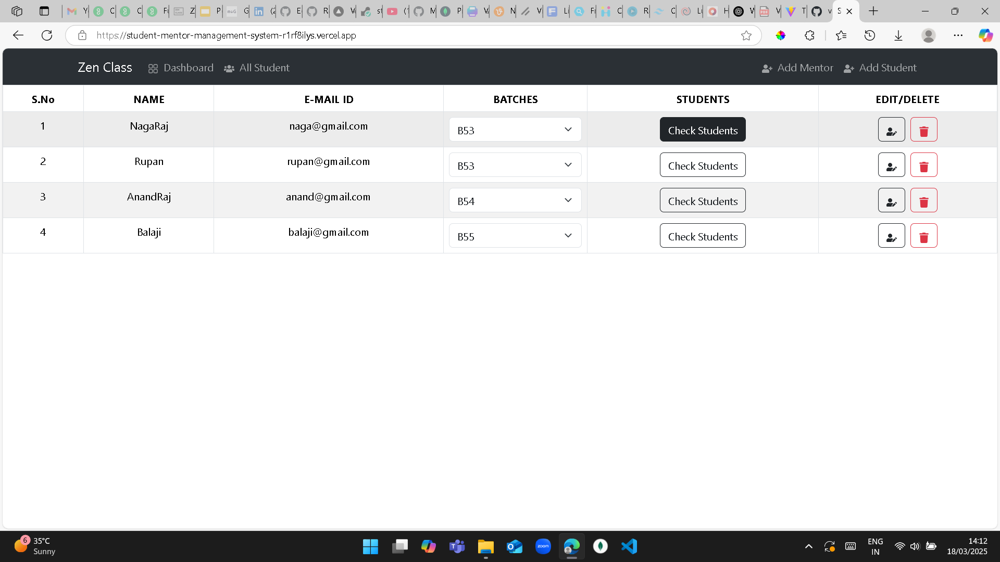
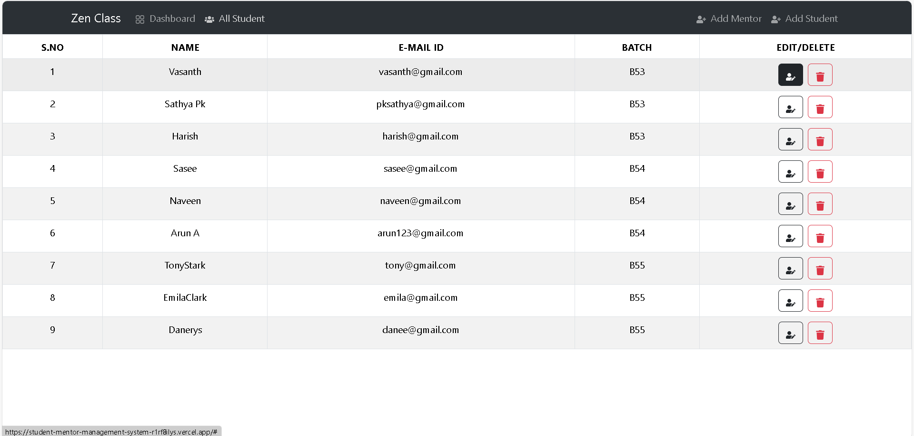

# 🎓 Student Mentor Management System (Frontend)

A **MERN Stack** web application that helps manage **students and mentors efficiently**. Admins can **add, edit, assign mentors to students**, and view student-mentor relationships in an intuitive UI. The system is connected to a **MongoDB backend** for persistent data storage.  

---

## 📖 Project Overview  

This project provides a **structured way** to handle student-mentor assignments. Users can:  

- Add **students and mentors**.    
- View **which students are assigned to which mentors**.  
- Update or delete student and mentor details.  

### 🔹 Key Features  

✅ **📌 Admin Dashboard** – Manage students & mentors easily.  
✅ **👨‍🏫 Student & Mentor Management** – Add, edit, update, and delete records.  
✅ **🔀 Assign Mentors** – Assign or reassign students to a mentor.  
✅ **📂 View Student-Mentor Relationship** – Organized batch-wise listing.  
✅ **🗂️ Data Persistence** – Backend powered by **MongoDB & Express.js**.   
✅ **🚀 Deployed on Vercel (Frontend) & Render (Backend)**.  

---

## 📸 Screenshots  

📌 **Dashboard**  
  

📌 **All Student List**  
  

---

## 🛠️ Tech Stack  

| **Technology** | **Description** |
|--------------|-------------|
| **React.js** | Frontend UI framework |
| **MongoDB** | NoSQL Database for storing students & mentors |
| **Express.js** | Backend framework to handle API requests |
| **Node.js** | Runtime environment for server-side code |
| **Bootstrap / Tailwind CSS** | Responsive UI framework |
| **Axios** | API requests to backend |
| **Vercel & Render** | Hosting for frontend & backend |

---

